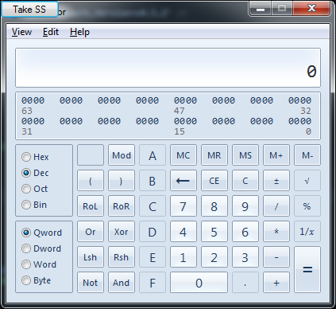
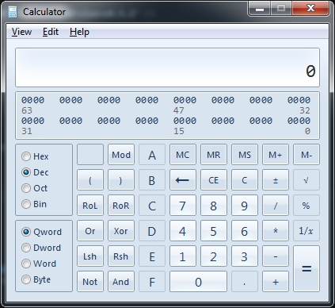

# TopMostApplication
Add a screenshot button to your favorite application

Press the button -> Receive screenshot.  It really is that easy.  Need to take 100 screenshots from within Chrome or Internet Explorer, so you can document a web application?  Done in a matter of minutes instead of hours (paint? blech!)

What you see:

What gets saved to disk:

# Configuration
Configuration is done in the file TopMostApplication.exe.config

